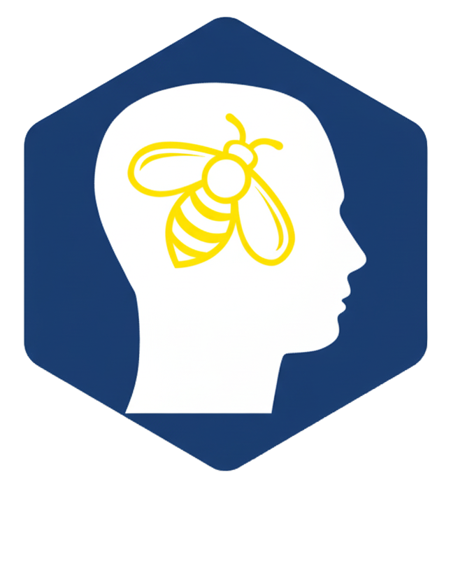

# TheHiveMCP

<div align="center">
  
</div>

[](https://golang.org/doc/go1.24)
[](LICENSE)

**Model Context Protocol server for TheHive security platform**

## Overview

TheHiveMCP is an MCP (Model Context Protocol) server that enables AI agents to interact with [TheHive](https://strangebee.com/thehive/) security platform through natural language. Built in Go, it provides a structured interface for security operations, case management, and threat intelligence workflows.

### Key Features

- **MCP 1.0 Compliant** - Full implementation of Model Context Protocol specification
- **Multiple Transport Modes**:
  - 🌐 HTTP - Scalable HTTP transport with SSE support
  - 🪠 Stdio - CLI/pipe operations for local integration
- **Comprehensive Security Operations**:
  - Natural language entity search (alerts, cases, tasks, observables)
  - Full CRUD operations on TheHive entities
  - Cortex analyzer and responder execution
  - Dynamic resource catalog with live metadata

## What This Does

**TheHiveMCP is a connector that enables AI assistants to interact with TheHive security platform.**

This project acts as a **translation layer** between AI assistants (like ChatGPT, Claude, or other LLMs) and TheHive's API. It doesn't contain AI itself - instead, it provides AI assistants with the tools they need to understand and work with security data.

**How it works:** When you connect an AI assistant to TheHiveMCP, the AI can:
- Understand TheHive's data structure and capabilities
- Translate natural language requests into proper TheHive operations
- Search for security incidents, cases, and threats
- Create and manage investigations
- Execute automated analysis and response actions

**Real-world example:** An analyst using ChatGPT with TheHiveMCP can say *"Show me high-severity phishing alerts from last week"* and ChatGPT will use TheHiveMCP to query TheHive's database and present the results in an organized, actionable format.

This enables security teams to **leverage existing AI assistants** for security operations without replacing their current tools or workflows. TheHiveMCP handles the technical complexity of integrating with TheHive, so AI assistants can focus on understanding security context and providing intelligent insights.

## Project Structure

```
TheHiveMCP/
├── cmd/server/         # Main entrypoint
├── bootstrap/          # Server initialization (public API)
├── internal/           # Core components (tools, resources, prompts, utils)
├── deployment/         # Docker configuration
└── Makefile
```

## Getting Started

This guide helps you connect TheHiveMCP to popular AI assistants through MCP (Model Context Protocol) hosts. Choose your preferred AI assistant below for step-by-step setup instructions.

### What You'll Need

- A running **TheHive 5.x** instance with API access
- Your **TheHive API key** and URL
- An AI assistant that supports MCP (Claude Desktop, or other MCP clients)

---

### 🖥️ Claude Desktop (Recommended)

**Claude Desktop** supports MCPB (Model Context Protocol Binary) files for easy one-click installation of MCP servers like TheHiveMCP.

#### Step 1: Install Claude Desktop
Download and install [Claude Desktop](https://claude.ai/download) for your operating system.

#### Step 2: Download TheHiveMCP MCPB Package
Download the appropriate MCPB file for your system from the [latest release](https://github.com/StrangeBeeCorp/TheHiveMCP/releases):

- **macOS (Intel)**: `thehivemcp-v0.2.0-darwin-amd64.mcpb`
- **macOS (Apple Silicon)**: `thehivemcp-v0.2.0-darwin-arm64.mcpb`
- **Windows (64-bit)**: `thehivemcp-v0.2.0-windows-amd64.mcpb`
- **Linux (64-bit)**: `thehivemcp-v0.2.0-linux-amd64.mcpb`
- **Linux (ARM64)**: `thehivemcp-v0.2.0-linux-arm64.mcpb`

#### Step 3: Install the MCPB Package
Double-click the downloaded `.mcpb` file, and Claude Desktop will automatically:
- Install the TheHiveMCP server
- Prompt you to configure your TheHive connection settings
- Add TheHiveMCP to your available tools

#### Step 4: Configure TheHive Connection
When prompted during installation, provide:
- **TheHive URL**: Your TheHive instance URL (e.g., `https://thehive.company.com`)
- **API Key**: Your TheHive API key for authentication
- **Organisation**: Your TheHive organisation name
- **OpenAI API Key**: (Optional) For enhanced natural language processing

#### Step 5: Test Your Setup
After installation, restart Claude Desktop and look for the 🔧 tools icon. Try asking: *"Show me recent high-severity alerts from TheHive"* or *"What security cases are currently open?"*

---

### 🐳 Docker (Alternative Setup)

If you prefer Docker or need more control over the server configuration:

#### Step 1: Run TheHiveMCP Server
```bash
docker run -d \
  --name thehive-mcp \
  -p 8082:8082 \
  -e THEHIVE_URL=https://your-thehive-instance.com \
  -e THEHIVE_API_KEY=your-api-key-here \
  -e MCP_BIND_HOST=0.0.0.0 \
  -e MCP_PORT=8082 \
  strangebee/thehive-mcp:latest
```

#### Step 2: Configure Your MCP Client
Point your MCP client to connect to the HTTP server at `http://localhost:8082/mcp`.

---

### 🔧 Other MCP Clients

TheHiveMCP works with any MCP-compatible client. Popular options include:

- **[MCP CLI](https://github.com/modelcontextprotocol/mcp-cli)** - Command-line interface
- **Custom Applications** - Using MCP client libraries

For these clients, use either:
- **Binary**: Download the appropriate binary for your platform from [releases](https://github.com/StrangeBeeCorp/TheHiveMCP/releases) and run with `--transport stdio`
- **HTTP server**: Point to `http://localhost:8082/mcp` after running the Docker container above


## Configuration

TheHiveMCP supports three configuration methods with the following priority (highest to lowest):
1. **HTTP Request Headers** (for HTTP transport only)
2. **Command-line Flags**
3. **Environment Variables**

<details>
<summary><strong>⚙️ Configuration Parameters</strong></summary>

### Configuration Parameters

| Parameter | Environment Variable | Command-line Flag | HTTP Header | Default | Description |
|-----------|---------------------|-------------------|-------------|---------|-------------|
| **TheHive Connection** |
| TheHive URL | `THEHIVE_URL` | `--thehive-url` | - | - | TheHive instance URL (required) |
| API Key | `THEHIVE_API_KEY` | `--thehive-api-key` | `Authorization` or `X-TheHive-Api-Key` | - | TheHive API key |
| Username | `THEHIVE_USERNAME` | `--thehive-username` | - | - | Username for basic auth |
| Password | `THEHIVE_PASSWORD` | `--thehive-password` | - | - | Password for basic auth |
| Organisation | `THEHIVE_ORGANISATION` | `--thehive-organisation` | `X-TheHive-Org` | - | TheHive organisation |
| **MCP Server** |
| Transport Type | - | `--transport` | - | `http` | Transport mode: `http` or `stdio` |
| Bind Address | `MCP_BIND_HOST` + `MCP_PORT` | `--addr` | - | - | HTTP server bind address (e.g., `0.0.0.0:8082`) |
| Endpoint Path | `MCP_ENDPOINT_PATH` | `--mcp-endpoint-path` | - | `/mcp` | HTTP endpoint path |
| Heartbeat Interval | `MCP_HEARTBEAT_INTERVAL` | `--mcp-heartbeat-interval` | - | `30s` | Heartbeat interval for HTTP connections |
| **OpenAI Integration** |
| API Key | `OPENAI_API_KEY` | `--openai-api-key` | - | - | OpenAI-compatible API key |
| Base URL | `OPENAI_BASE_URL` | `--openai-base-url` | - | `https://api.openai.com/v1` | OpenAI-compatible API base URL |
| Model | `OPENAI_MODEL` | `--openai-model` | - | `gpt-5` | Model name |
| Max Tokens | `OPENAI_MAX_TOKENS` | `--openai-max-tokens` | - | `32000` | Maximum tokens for completions |
| **Logging** |
| Log Level | `LOG_LEVEL` | `--log-level` | - | `info` | Logging level |

### Example Configuration

```bash
# .env file
THEHIVE_URL=https://thehive.example.com
THEHIVE_API_KEY=your_api_key
THEHIVE_ORGANISATION=your_organisation
MCP_BIND_HOST=0.0.0.0
MCP_PORT=8082
OPENAI_API_KEY=sk-your-key  # Optional, for fallback LLM
LOG_LEVEL=INFO
```

**Multi-tenant:** Override authentication per-request using `Authorization` and `X-TheHive-Org` headers.

</details>

<details>
<summary><strong>🚀 Advanced Features</strong></summary>

## Advanced Features

### MCP Sampling

Natural language queries in `search-entities` require an LLM. TheHiveMCP uses client-side sampling if available, otherwise falls back to server-side OpenAI. Configure `OPENAI_API_KEY` for fallback support. Without either, natural language search will fail (other tools work normally).

### MCP Elicitation

Modifying operations (create, update, delete) request user confirmation if the client supports elicitation. Without support, operations proceed automatically.

</details>

## Deployment Options

### Standalone Server (HTTP or Stdio)

Standard deployment runs TheHiveMCP as a standalone server process. See [Installation](#installation) section.

### In-Process Integration

Embed TheHiveMCP into Go applications using the `bootstrap` package:

```go
import "github.com/StrangeBeeCorp/TheHiveMCP/bootstrap"

// Use environment credentials
mcpServer := bootstrap.GetMCPServerAndRegisterTools()

// Or use custom credentials
creds := &bootstrap.TheHiveCredentials{
    URL: "https://thehive.example.com", APIKey: "key", Organisation: "org",
}
mcpServer := bootstrap.GetInprocessServer(creds)
```

**Note:** Only the `bootstrap` package is public API. Internal packages may change without notice.

## MCP Tools

- **search-entities**: Search for entities using natural language (e.g., "high severity alerts from last week")
- **manage-entities**: Create, update, delete entities, add comments
- **execute-automation**: Run Cortex analyzers and responders, check job status
- **get-resource**: Access schemas, docs, and metadata through hierarchical browsing (e.g., `uri="schema"` or `uri="metadata/automation"`)

<details>
<summary><strong>🔧 Detailed Tool Documentation</strong></summary>

### [get-resource](docs/tools/get-resource.md)
Access TheHive resources for documentation, schemas, and metadata. The entry point for exploring TheHive's capabilities through a hierarchical URI-based resource system.

**Key Features:**
- Browse resource catalog and categories with flexible navigation
- Access entity schemas (output, create, and update variants for each entity type)
- Query metadata for available options with subcategory support
- Get comprehensive documentation through hierarchical paths

**Schema Organization:**
- Output schemas: `hive://schema/{entity}` - Fields returned from queries
- Create schemas: `hive://schema/{entity}/create` - Required fields for creation
- Update schemas: `hive://schema/{entity}/update` - Available fields for updates

**Navigation Examples:**
- Browse automation metadata: `uri="metadata/automation"`
- List entity schemas: `uri="schema"`
- Get specific alert schema: `uri="hive://schema/alert"`

### [search-entities](docs/tools/search-entities.md)
Search for entities in TheHive using natural language queries. Uses AI to translate natural language into TheHive filters.

**Key Features:**
- Natural language query processing
- Support for all entity types (alerts, cases, tasks, observables)
- Flexible filtering and sorting options
- Custom column and data field selection

### [manage-entities](docs/tools/manage-entities.md)
Perform comprehensive CRUD operations on TheHive entities with full support for relationships and constraints.

**Key Features:**
- Create, update, delete operations for all entity types
- Comment support for cases and task logs
- Respect for entity hierarchies and relationships
- Batch operations support

### [execute-automation](docs/tools/execute-automation.md)
Execute Cortex analyzers and responders with comprehensive status monitoring and parameter customization.

**Key Features:**
- Run analyzers on observables for threat intelligence
- Execute responders for automated actions
- Monitor job and action status
- Support for custom parameters and multiple Cortex instances

</details>

## MCP Resources

Static resources include entity schemas (with separate output, create, and update variants) and documentation. Dynamic resources provide live data (users, templates, analyzers, responders, observable types).

<details>
<summary><strong>🔨 Development</strong></summary>

## Development

### Dockerized Development Workflow

All development operations use Docker containers for consistency and isolation:

**Core Commands:**
- `make all` - Format, security checks, tests, and build
- `make build` - Build binary using Docker
- `make run ARGS="arguments"` - Run application with custom arguments
- `make test` - Run tests with Docker network support for integration tests
- `make dev` - Development server with hot reload (requires local air)

**Quality & Security:**
- `make fmt` - Format code using Docker
- `make security` - Run all security checks (vulncheck, sast, vetlint)
- `make sast` - Static application security testing
- `make vetlint` - Linting checks
- `make vulncheck` - Vulnerability scanning

**Docker Operations:**
- `make docker-build` - Build production Docker image
- `make docker-run` - Run production container

**Dependencies:**
- `make updatedep` - Update Go dependencies
- `make install-dev-deps` - Install development tools (Docker-based)

**Utilities:**
- `make clean` - Remove build artifacts
- `make help` - Display all available targets

**Architecture:** Transport (`bootstrap/`), Tools (`internal/tools/`), Resources (`internal/resources/`), Integration (`internal/utils/`), Prompts (`internal/prompts/`)

</details>

## License

This project is licensed under the AGPL-3.0 License.

## Related Projects

- [TheHive](https://github.com/TheHive-Project/TheHive) - Security Incident Response Platform
- [thehive4go](https://github.com/StrangeBeeCorp/thehive4go) - TheHive Go SDK
- [mcp-go](https://github.com/mark3labs/mcp-go) - Model Context Protocol Go SDK
- [Hivemind](https://github.com/StrangeBeeCorp/hivemind) - Previous generation MCP server

---

Open source project maintained by StrangeBee. [Issues & contributions welcome](https://github.com/StrangeBeeCorp/TheHiveMCP/issues).
