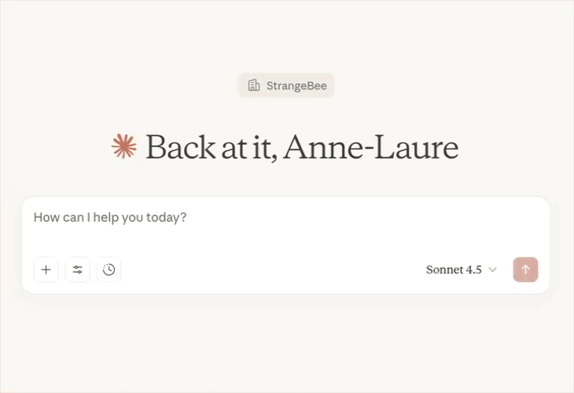

# TheHiveMCP

<div align="center">
  
</div>

[](https://golang.org/doc/go1.24)

**Model Context Protocol server for TheHive security platform**

> **⚠️ BETA WARNING: NOT FOR PRODUCTION USE**
>
> **This project is in BETA version and is insufficiently tested. Do NOT use with real production data.**
>
> <details>
> <summary><strong>🚨 Current Limitations and Security Risks</strong></summary>
>
> ### Security Risks
> - **Prompt Injection Vulnerabilities**: AI prompts may be exploited to bypass security controls
> - **Data Exposure**: Beta-level data filtering may not properly restrict sensitive information
> - **Authentication Bypass**: Security mechanisms are not fully hardened
> - **Audit Trail Gaps**: Incomplete logging of security-sensitive operations
>
> ### Feature Limitations
> - **No TTP (Tactics, Techniques, Procedures) Support**: MITRE ATT&CK integration not implemented
> - **Limited Responder Support**: Cortex responder execution has known issues and limitations
> - **No Alert Comments**: Alert commenting functionality not implemented
> - **Limited Observable Types**: Some specialized observable types not fully supported
> - **No Case Templates**: Custom case template support not implemented
> - **Limited Task Management**: Advanced task workflows not fully supported
> - **No Dashboard Integration**: No support for TheHive dashboard widgets or custom views
> - **Basic Permission Model**: Advanced RBAC features incomplete
>
> ### Recommended Usage
> - **Development and Testing Only**: Use with test data and development instances
> - **Proof of Concept**: Evaluate integration potential with non-sensitive data
> - **Sandbox Environment**: Deploy in isolated environments with restricted network access
>
> Production use requires thorough security review and extensive testing.
> </details>

## 🌍 Overview

TheHiveMCP is an MCP (Model Context Protocol) server that enables AI agents to interact with [TheHive](https://strangebee.com/thehive/) security platform through natural language. Built in Go, it provides a structured interface for security operations, case management, and threat intelligence workflows.


<div align="center">
  
</div>

### 🦄 Key features

- **MCP 1.0 compliant** - Full implementation of MCP specification
- **Multiple transport modes**:
  - 🌐 HTTP - Scalable HTTP transport with SSE support
  - 🪠 Stdio - CLI/pipe operations for local integration
- **Comprehensive security operations**:
  - Natural language entity search (alerts, cases, tasks, observables)
  - Full CRUD operations on TheHive entities
  - Workflow operations (promote alerts to cases, merge entities)
  - Cortex analyzer and responder execution
  - Dynamic resource catalog with live metadata

## 🤔 How It Works

**TheHiveMCP is a connector that enables AI assistants to interact with TheHive security platform.**

This project acts as a **translation layer** between AI assistants (like ChatGPT, Claude, or other LLMs) and TheHive API. It doesn't contain AI itself - instead, it provides AI assistants with the tools they need to understand and work with security data.

When you connect an AI assistant to TheHiveMCP, the AI can:
- Understand TheHive data structure and capabilities
- Translate natural language requests into proper TheHive operations
- Search for security incidents, cases, and threats
- Create and manage investigations
- Execute automated analysis and response actions

**Real-world example:** An analyst using ChatGPT with TheHiveMCP can say *"Show me high-severity phishing alerts from last week"* and ChatGPT will use TheHiveMCP to query TheHive database and present the results in an organized, actionable format.

This enables security teams to **leverage existing AI assistants** for security operations without replacing their current tools or workflows. TheHiveMCP handles the technical complexity of integrating with TheHive, so AI assistants can focus on understanding security context and providing intelligent insights.

## 🪜 Project Structure

```
TheHiveMCP/
├── cmd/server/         # Main entrypoint
├── bootstrap/          # Server initialization (public API)
├── internal/           # Core components (tools, resources, prompts, utils)
├── deployment/         # Docker configuration
└── Makefile
```

## 🎮 Get Started

This guide helps you connect TheHiveMCP to popular AI assistants through MCP hosts. Choose your preferred AI assistant below for step-by-step setup instructions.

### What you'll need

- A running **TheHive 5.x** instance with API access
- Your **TheHive API key** and URL
- An AI assistant that supports MCP (Claude Desktop or other MCP clients)

---

<details>
<summary><strong>🖥️ Claude Desktop (Recommended - Easiest Setup)</strong></summary>

**Claude Desktop** supports MCPB (Model Context Protocol Binary) files for easy one-click installation of MCP servers like TheHiveMCP.

#### Step 1: Install Claude Desktop
Download and install [Claude Desktop](https://claude.ai/download) for your operating system.

#### Step 2: Download TheHiveMCP MCPB package
Download the appropriate MCPB file for your system from the [latest release](https://github.com/StrangeBeeCorp/TheHiveMCP/releases):

- **macOS (Intel)**: `thehivemcp-v0.2.0-darwin-amd64.mcpb`
- **macOS (Apple Silicon)**: `thehivemcp-v0.2.0-darwin-arm64.mcpb`
- **Windows (64-bit)**: `thehivemcp-v0.2.0-windows-amd64.mcpb`
- **Linux (64-bit)**: `thehivemcp-v0.2.0-linux-amd64.mcpb`
- **Linux (ARM64)**: `thehivemcp-v0.2.0-linux-arm64.mcpb`

#### Step 3: Install the MCPB package
Double-click the downloaded `.mcpb` file. Claude Desktop automatically:
- Installs TheHiveMCP server
- Prompts you to configure your TheHive connection settings
- Adds TheHiveMCP to your available tools

#### Step 4: Configure TheHive connection
When prompted during installation, provide:
- **TheHive URL**: Your TheHive instance URL (for example, `https://thehive.company.com`)
- **API Key**: Your TheHive API key for authentication
- **Organisation**: Your TheHive organisation name
- **Permissions config**: (Optional) Choose from:
  - `read_only` - Default safe mode (search only, no modifications)
  - `admin` - Full access (for testing/development only)
  - Custom path to your permissions YAML file
- **OpenAI API Key**: (Optional) For natural language processing fallback when MCP client doesn't support sampling


#### Step 5: Test your setup
After installation, restart Claude Desktop and look for the 🔧 tools icon. Try asking: *"Show me recent high-severity alerts from TheHive"* or *"What security cases are currently open?"*

</details>

<details>
<summary><strong>🐳 Docker Deployment (Flexible & Scalable)</strong></summary>

#### Step 1: Run TheHiveMCP server

#### Quick Docker setup

For immediate testing and development:

```bash
docker run -d \
  --name thehive-mcp \
  -p 8082:8082 \
  -e THEHIVE_URL=https://your-thehive-instance.com \
  -e THEHIVE_API_KEY=your-api-key-here \
  -e MCP_BIND_HOST=0.0.0.0 \
  -e MCP_PORT=8082 \
  strangebee/thehive-mcp:latest
```


#### Docker Compose (Recommended for teams)

Create `docker-compose.yml`:
```yaml
services:
  thehive-mcp:
    image: strangebee/thehive-mcp:latest
    ports:
      - "8082:8082"
    environment:
      - THEHIVE_URL=${THEHIVE_URL}
      - THEHIVE_API_KEY=${THEHIVE_API_KEY}
      - THEHIVE_ORGANISATION=${THEHIVE_ORGANISATION}
      - MCP_BIND_HOST=0.0.0.0
      - MCP_PORT=8082
      - PERMISSIONS_CONFIG=/app/permissions.yaml
    volumes:
      - ./config/permissions.yaml:/app/permissions.yaml:ro
    restart: unless-stopped
```

```bash
# Start services
docker-compose up -d
```

##### Step 2: Configure your MCP client

Point your MCP client to connect to the HTTP server at `http://localhost:8082/mcp`.

**🐳 For advanced Docker setups:** See [Remote Docker Guide](docs/examples/remote-docker.md) for scalable HTTP deployments with multi-tenant configuration.

</details>

<details>
<summary><strong>💻 Local Usage (Stdio)</strong></summary>

### Download Pre-built binary

```bash
# Download for your platform from releases
curl -L -o thehivemcp https://github.com/StrangeBeeCorp/TheHiveMCP/releases/latest/download/thehivemcp-[platform]-[arch]
chmod +x thehivemcp
```

### Run with Stdio transport

In your MCP host MCP config file (like `claude_desktop_settings.json`) add the following configuration:

```bash
```json
{
  "mcpServers": {
    "thehive": {
      "command": "/path/to/thehivemcp",
      "args": ["--transport", "stdio"],
      "env": {
        "THEHIVE_URL": "https://your-thehive-instance.com",
        "THEHIVE_API_KEY": "your-api-key-here",
        "THEHIVE_ORGANISATION": "your-org-name",
        "PERMISSIONS_CONFIG": "read_only",
        "OPENAI_API_KEY": "your-api-key-here",
        "OPENAI_MODEL": "gpt5"
      }
    }
  }
}
```

Most MCP hosts don't support Sampling. Check if yours does [here][https://modelcontextprotocol.io/clients].

If it does, you can remove the OpenAI key and model from the config.

### Run as HTTP server

```bash
# Run HTTP server for web clients
./thehivemcp --transport http \
  --addr "0.0.0.0:8082" \
  --thehive-url "$THEHIVE_URL" \
  --thehive-api-key "$THEHIVE_API_KEY" \
  --thehive-organisation "$THEHIVE_ORGANISATION"
```

**💻 For local MCP host integration:** See [stdio Local Guide](docs/examples/stdio-local.md) for GitHub Copilot, Claude Desktop, and other local MCP clients.

</details>

<details>
<summary><strong>🔗 In-Process integration (Go applications)</strong></summary>

Embed TheHiveMCP directly into Go applications:

```go
import "github.com/StrangeBeeCorp/TheHiveMCP/bootstrap"

// Use environment credentials
mcpServer := bootstrap.GetMCPServerAndRegisterTools()

// Or use custom credentials with permissions
creds := &bootstrap.TheHiveCredentials{
    URL: "https://thehive.example.com",
    APIKey: "key",
    Organisation: "org",
}
mcpServer := bootstrap.GetInprocessServer(creds, "/path/to/permissions.yaml")
bootstrap.RegisterToolsToMCPServer(mcpServer)
```

**Note:** Only the `bootstrap` package is public API. Internal packages may change without notice.

</details>

### � Deployment quick reference

| Deployment Type | Use Case | Complexity | Guide |
|----------------|----------|------------|-------|
| **Claude Desktop MCPB** | Personal use, quick start | ⭐ Easy | Above ⬆️ |
| **stdio Local** | Local MCP hosts (GitHub Copilot) | ⭐⭐ Simple | [stdio Guide](docs/examples/stdio-local.md) |
| **Remote Docker** | Team/cloud deployment | ⭐⭐⭐ Medium | [Remote Guide](docs/examples/remote-docker.md) |
| **LibreChat** | Complete AI assistant setup | ⭐⭐⭐⭐ Advanced | [LibreChat Guide](docs/examples/librechat.md) |

---

## ⚙️ Configuration

TheHiveMCP supports flexible configuration through multiple methods with hierarchical priority:

### Configuration priority (highest to lowest)

1. **🌐 HTTP Request Headers** (HTTP transport only) - Per-request overrides for multi-tenant scenarios
2. **⚡ Command-line Flags** - Explicit runtime parameters
3. **🔧 Environment Variables** - System-level defaults (.env files supported)

This allows you to set defaults via environment variables while overriding specific values per-request via headers or command-line flags.

<details>
<summary><strong>⚙️ Configuration parameters</strong></summary>

### Configuration parameters

| Parameter | Environment variable | Command-line flag | HTTP header | Default | Description |
|-----------|---------------------|-------------------|-------------|---------|-------------|
| **TheHive connection** |
| TheHive URL | `THEHIVE_URL` | `--thehive-url` | `X-TheHive-Url` | - | TheHive instance URL (required) |
| API key | `THEHIVE_API_KEY` | `--thehive-api-key` | `Authorization` or `X-TheHive-Api-Key` | - | TheHive API key |
| Username | `THEHIVE_USERNAME` | `--thehive-username` | - | - | Username for basic auth |
| Password | `THEHIVE_PASSWORD` | `--thehive-password` | - | - | Password for basic auth |
| Organisation | `THEHIVE_ORGANISATION` | `--thehive-organisation` | `X-TheHive-Org` | - | TheHive organisation |
| **Permissions** |
| Permissions config | `PERMISSIONS_CONFIG` | `--permissions-config` | - | `read_only` | Permissions: `read_only`, `admin`, or YAML file path |
| **MCP server** |
| Transport type | - | `--transport` | - | `http` | Transport mode: `http` or `stdio` |
| Bind address | `MCP_BIND_HOST` + `MCP_PORT` | `--addr` | - | - | HTTP server bind address (for example, `0.0.0.0:8082`) |
| Endpoint path | `MCP_ENDPOINT_PATH` | `--mcp-endpoint-path` | - | `/mcp` | HTTP endpoint path |
| Heartbeat interval | `MCP_HEARTBEAT_INTERVAL` | `--mcp-heartbeat-interval` | - | `30s` | Heartbeat interval for HTTP connections |
| **OpenAI Integration** |
| API key | `OPENAI_API_KEY` | `--openai-api-key` | `X-OpenAI-Api-Key` | - | OpenAI-compatible API key |
| Base URL | `OPENAI_BASE_URL` | `--openai-base-url` | `X-OpenAI-Base-Url` | `https://api.openai.com/v1` | OpenAI-compatible API base URL |
| Model | `OPENAI_MODEL` | `--openai-model` | `X-OpenAI-Model-Name` | `gpt-4` | Model name |
| Max tokens | `OPENAI_MAX_TOKENS` | `--openai-max-tokens` | `X-OpenAI-Max-Tokens` | `32000` | Maximum tokens for completions |
| **Logging** |
| Log level | `LOG_LEVEL` | `--log-level` | - | `info` | Logging level |

### Example configuration

```bash
# .env file - Base configuration
THEHIVE_URL=https://thehive.example.com
THEHIVE_API_KEY=<thehive_api_key>
THEHIVE_ORGANISATION=<thehive_organisation>
PERMISSIONS_CONFIG=docs/examples/permissions/analyst.yaml  # Optional, defaults to read-only
MCP_BIND_HOST=0.0.0.0
MCP_PORT=8082
OPENAI_API_KEY=<openai_api_key>  # Optional, for fallback LLM
LOG_LEVEL=INFO
# Permissions options (choose one):
# PERMISSIONS_CONFIG=read_only                              # Default: safe read-only access
# PERMISSIONS_CONFIG=admin                                  # Full access (development/testing only)
# PERMISSIONS_CONFIG=docs/examples/permissions/analyst.yaml # Custom permissions file

# Optional AI features:
# OPENAI_API_KEY=sk-your-key    # Fallback when client doesn't support sampling
```

### Multi-tenant & Per-Request Configuration

**HTTP Headers** (HTTP transport only):
```bash
curl -X POST http://localhost:8082/mcp \
  -H "Authorization: Bearer different-api-key" \
  -H "X-TheHive-Org: other-org" \
  -H "X-TheHive-Url: https://other-thehive.com" \
  -d '{"method":"initialize",...}'
```

### Built-in Permission Profiles

- **`read_only`** (default): Search entities, browse resources only
- **`admin`**: Full access to all operations (development/testing only)
- **Custom file**: Fine-grained permissions via YAML configuration

See [docs/permissions.md](docs/permissions.md) for detailed permission configuration and examples.

</details>

## 🚀 Advanced features

<details>
<summary><strong>🤖 MCP sampling</strong></summary>

### 🤖 MCP Sampling (AI-Powered Natural Language)

TheHiveMCP uses **MCP Sampling** for natural language processing in the `search-entities` tool to convert queries like *"high severity alerts from last week"* into TheHive filters.

**How it works:**
1. **Client-side sampling** (preferred): Uses the MCP client's built-in AI model
2. **Server-side fallback**: Uses OpenAI API when client doesn't support sampling
3. **Graceful degradation**: Without either, natural language search fails but other tools work normally

**Current MCP client support:**
- ✅ **Github Copilot**: Full sampling support
- ❌ **Most other MCP clients**: Limited or no sampling support (including Claude Desktop)
- 🔧 **Workaround**: Configure `OPENAI_API_KEY` for server-side processing

```bash
# Enable server-side fallback for clients without sampling
export OPENAI_API_KEY=sk-your-openai-key
export OPENAI_BASE_URL=https://api.openai.com/v1  # Or OpenRouter for more models
```
</details>

<details>
<summary><strong>🛡️ MCP Elicitation</strong></summary>

### 🛡️ MCP Elicitation (User Confirmation)

TheHiveMCP uses **MCP Elicitation** to request user confirmation before executing potentially dangerous operations (create, update, delete entities).

**How it works:**
1. **Supported clients**: Show confirmation dialog before executing modifications
2. **Unsupported clients**: Operations proceed automatically (logged with warnings)
3. **Security layer**: Prevents accidental data modification

**Current MCP client support:**
- ✅ **Github Copilot**: Full elicitation support with confirmation dialogs
- ❌ **Most other MCP clients**: No elicitation support (including Claude Desktop)
- ⚠️ **Security note**: Use restrictive permissions with clients that don't support elicitation

**Example elicitation prompt:**
```
Confirm POST request to TheHive API?

Operation: Create Alert
Entity: {"title": "Security Incident", "severity": 3, ...}
```

</details>

## 🛠️ MCP Tools

- **search-entities**: Search for entities using natural language (for example, "high severity alerts from last week")
- **manage-entities**: Create, update, delete entities, add comments, promote alerts to cases, merge cases/alerts/observables
- **execute-automation**: Run Cortex analyzers and responders, check job and action status
- **get-resource**: Access schemas, docs, and metadata through hierarchical browsing (for example, `uri="hive://schema"` or `uri="hive://metadata/automation"`)

<details>
<summary><strong>🔧 Detailed tool documentation</strong></summary>

### [get-resource](docs/tools/get-resource.md)
Access TheHive resources for documentation, schemas, and metadata. The entry point for exploring TheHive capabilities through a hierarchical URI-based resource system.

**Key features:**
- Browse resource catalog and categories with flexible navigation
- Access entity schemas (output, create, and update variants for each entity type)
- Query metadata for available options with subcategory support
- Get comprehensive documentation through hierarchical paths

**Schema organisation:**
- Output schemas: `hive://schema/{entity}` - Fields returned from queries
- Create schemas: `hive://schema/{entity}/create` - Required fields for creation
- Update schemas: `hive://schema/{entity}/update` - Available fields for updates

**Navigation examples:**
- Browse automation metadata: `uri="hive://metadata/automation"`
- List entity schemas: `uri="hive://schema"`
- Get specific alert schema: `uri="hive://schema/alert"`

### [search-entities](docs/tools/search-entities.md)
Search for entities in TheHive using natural language queries. Uses AI to translate natural language into TheHive filters.

**Key features:**
- Natural language query processing
- Support for all entity types (alerts, cases, tasks, observables)
- Flexible filtering and sorting options
- Custom column and data field selection
- Count-only queries for performance optimization

### [manage-entities](docs/tools/manage-entities.md)
Perform comprehensive CRUD and workflow operations on TheHive entities with full support for relationships and constraints.

**Key features:**
- Create, update, delete operations for all entity types
- Comment support for cases and task logs
- Promote alerts to cases
- Merge cases together, merge alerts into cases, deduplicate observables
- Respect for entity hierarchies and relationships
- Batch operations support

### [execute-automation](docs/tools/execute-automation.md)
Execute Cortex analyzers and responders with comprehensive status monitoring and parameter customization.

**Key features:**
- Run analyzers on observables for threat intelligence
- Execute responders for automated actions
- Monitor job and action status
- Support for custom parameters and multiple Cortex instances

</details>

## 🪵 MCP Resources

Static resources include entity schemas (with separate output, create, and update variants) and documentation. Dynamic resources provide live data (users, templates, analyzers, responders, observable types).

<details>
<summary><strong>🔨 Development</strong></summary>

## Development

### Dockerized development workflow

All development operations use Docker containers for consistency and isolation:

**Core commands:**
- `make all` - Format, security checks, tests, and build
- `make build` - Build binary using Docker
- `make run ARGS="arguments"` - Run application with custom arguments
- `make test` - Run tests with Docker network support for integration tests
- `make dev` - Development server with hot reload (requires local air)

**Quality and security:**
- `make fmt` - Format code using Docker
- `make security` - Run all security checks (vulncheck, sast, vetlint)
- `make sast` - Static application security testing
- `make vetlint` - Linting checks
- `make vulncheck` - Vulnerability scanning

**Docker operations:**
- `make docker-build` - Build production Docker image
- `make docker-run` - Run production container

**Dependencies:**
- `make updatedep` - Update Go dependencies
- `make install-dev-deps` - Install development tools (Docker-based)

**Utilities:**
- `make clean` - Remove build artifacts
- `make help` - Display all available targets

**Architecture:** Transport (`bootstrap/`), Tools (`internal/tools/`), Resources (`internal/resources/`), Integration (`internal/utils/`), Prompts (`internal/prompts/`)

</details>

## Related Projects

- [TheHive](https://github.com/TheHive-Project/TheHive) - Security Incident Response Platform
- [thehive4go](https://github.com/StrangeBeeCorp/thehive4go) - TheHive Go SDK
- [mcp-go](https://github.com/mark3labs/mcp-go) - Model Context Protocol Go SDK

---

Open source project maintained by StrangeBee. [Issues and contributions welcome](https://github.com/StrangeBeeCorp/TheHiveMCP/issues).
