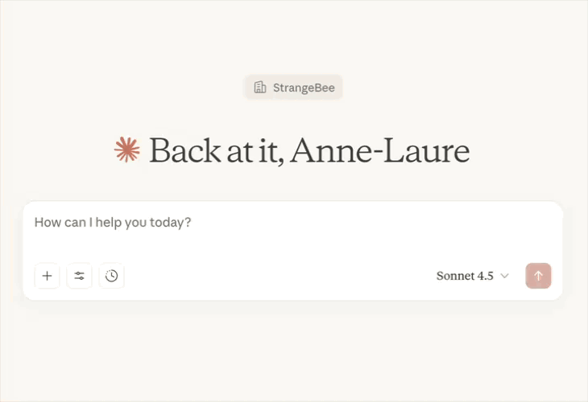

# TheHiveMCP

<div align="center">
  
</div>

[](https://golang.org/doc/go1.26)

**Model Context Protocol server for TheHive security platform**

## 🌍 Overview

TheHiveMCP is an MCP (Model Context Protocol) server that enables AI agents to interact with [TheHive](https://strangebee.com/thehive/) security platform
through natural language. Built in Go, it provides a structured interface for security operations, case management, and threat intelligence workflows.

<div align="center">
  
</div>

### 🦄 Key features

- **MCP 1.0 compliant** - Full implementation of MCP specification
- **Multiple transport modes**:
  - 🌐 HTTP - Scalable HTTP transport with SSE support
  - 🪠 Stdio - CLI/pipe operations for local integration
- **Comprehensive security operations**:
  - Structured entity search via TheHive's query DSL (alerts, cases, tasks, observables)
  - Full CRUD operations on TheHive entities
  - Workflow operations (promote alerts to cases, merge entities)
  - Cortex analyzer and responder execution
  - Dynamic resource catalog with live metadata

## 🤔 How It Works

**TheHiveMCP is a connector that enables AI assistants to interact with TheHive security platform.**

This project acts as a **translation layer** between AI assistants (like ChatGPT, Claude, or other LLMs) and TheHive API. It doesn't contain AI itself -
instead, it provides AI assistants with the tools they need to understand and work with security data.

When you connect an AI assistant to TheHiveMCP, the AI can:

- Understand TheHive data structure and capabilities
- Translate natural language requests into proper TheHive operations
- Search for security incidents, cases, and threats
- Create and manage investigations
- Execute automated analysis and response actions

**Real-world example:** An analyst using ChatGPT with TheHiveMCP can say _"Show me high-severity phishing alerts from last week"_ and ChatGPT will use
TheHiveMCP to query TheHive database and present the results in an organized, actionable format.

This enables security teams to **leverage existing AI assistants** for security operations without replacing their current tools or workflows. TheHiveMCP
handles the technical complexity of integrating with TheHive, so AI assistants can focus on understanding security context and providing intelligent insights.

## ✅ Production-ready: what we commit to

TheHiveMCP is production-ready. Two things to know before you point it at real data:

- **Use a recommended model.** Our accuracy and security commitments hold only for the recommended models: **`anthropic/claude-sonnet-4.6`**,
  **`openai/gpt-5.5`**, **`moonshotai/kimi-k2.6`**, **`z-ai/glm-5.2`**, **`google/gemini-3.5-flash`**, and **`google/gemini-3.1-flash-lite`**. These are the
  models that clear both bars on the published evidence — see [`docs/evaluation/`](docs/evaluation/).
- **Security has a boundary.** The server tags all TheHive-sourced data as untrusted to resist prompt injection, but this **reduces, not eliminates** the risk
  and resilience varies by model — the `read_only` default is your enforced backstop.

The full contract — supported deployment shape, security and accuracy envelopes, and what we explicitly _don't_ commit to — is below and grounded in
[ADR-0001](docs/explanation/adr/0001-security-and-accuracy-testing-policy.md) and [RELEASING.md](RELEASING.md).

<details>
<summary><strong>📜 The full contract — what we vouch for, and what we don't</strong></summary>

### What we vouch for

- **Supported deployment shape.** A single Go server (Docker image or native binary) speaking MCP over **stdio** (local, single-user) or **HTTP**. HTTP is
  supported only **behind a TLS-terminating, authenticating reverse proxy** — the server serves plain HTTP and does not authenticate callers itself. Per
  request, callers supply their own TheHive credentials, and the target TheHive URL is restricted to `THEHIVE_URL` / `THEHIVE_URL_ALLOWLIST`. This is the shape
  we test and support; see the Get Started and Configuration sections below.

- **Recommended models only.** Accuracy is uniformly strong across models (68–100%); prompt-injection resilience is what separates them (53–100%), so it is the
  deciding bar. On the v1.0.0 evidence, the recommended list is the models that clear **both** high accuracy **and** ≥90% injection resilience:

  | Recommended model              | Accuracy | Injection resilience |
  | ------------------------------ | -------- | -------------------- |
  | `anthropic/claude-sonnet-4.6`  | 100%     | 100%                 |
  | `openai/gpt-5.5`               | 100%     | 100%                 |
  | `moonshotai/kimi-k2.6`         | 100%     | 100%                 |
  | `z-ai/glm-5.2`                 | 100%     | 100%                 |
  | `google/gemini-3.5-flash`      | 100%     | 100%                 |
  | `google/gemini-3.1-flash-lite` | 100%     | 93%                  |

  Other evaluated models may work but are **not recommended** — they fall short on injection resilience (e.g. `mistralai/mistral-medium-3.5` 73%,
  `qwen/qwen3.5-9b` 53%, `mistralai/ministral-8b-2512` 53%) and should not drive write-capable or automation tools on attacker-reachable data. Per-model results
  and the full field are in [`docs/evaluation/`](docs/evaluation/); a model earns its place only with published accuracy **and** security evidence tied to a
  server version.

- **Security posture, and its boundary.** Every user-generated field the server returns (titles, descriptions, comments, observable values, tags) is wrapped in
  `[UNTRUSTED_DATA]…[/UNTRUSTED_DATA]` boundary tags, and every tool tells the model never to follow instructions found inside them. We publish prompt-injection
  resilience per recommended model — the pass bar is strict: the agent must **both** ignore the injection **and** warn the analyst. _Boundary:_ this defense
  **reduces but does not eliminate** injection risk, and resilience still varies by model. Weaker models should not drive write-capable or automation tools on
  attacker-reachable data. The permission model (`read_only` default) is your enforced backstop — see [docs/reference/permissions.md](docs/reference/permissions.md).

- **Accuracy envelope, and its boundary.** We measure correct tool use across realistic, multi-step investigations — entity search, schema/resource discovery,
  case and observable management, and automation — end-to-end against a real TheHive instance with the real MCP server, no mocked tools. Per-model results are
  published in [`docs/evaluation/`](docs/evaluation/). _Boundary:_ the envelope is the tested surface at a named server version; it is not a guarantee of
  correctness on every prompt, and the model — not the server — is the dominant factor.

### What we explicitly do _not_ commit to

- **Arbitrary models.** Models not on the recommended list may work but are neither recommended nor evidenced. You run them at your own risk.
- **Untested workloads.** Feature areas and usage patterns outside the published evaluation surface are not part of the commitment.
- **Latency / throughput SLAs.** End-to-end latency is dominated by the model, not the thin Go layer, so we do not publish or commit to latency or throughput
  numbers.
- **Provider-side regressions between runs.** A vendor can change a model under a stable ID; we do not continuously detect this.

Evidence is kept current on a change-triggered basis: every publicly published server version is re-evaluated before release (or previous results are carried
forward for no-behavior-change releases). The full policy is in [RELEASING.md](RELEASING.md) and
[ADR-0001](docs/explanation/adr/0001-security-and-accuracy-testing-policy.md).

</details>

## 🪜 Project Structure

```text
TheHiveMCP/
├── cmd/server/         # Main entrypoint
├── bootstrap/          # Server initialization (public API)
├── internal/           # Core components (tools, resources, prompts, utils)
├── deployment/         # Docker configuration
└── Makefile
```

## 🎮 Get Started

This guide helps you connect TheHiveMCP to popular AI assistants through MCP hosts. Choose your preferred AI assistant below for step-by-step setup
instructions.

### What you'll need

- A running **TheHive 5.5+** instance with API access
- Your **TheHive API key** and URL
- An AI assistant that supports MCP (Claude Desktop or other MCP clients)

---

<details>
<summary><strong>🖥️ Claude Desktop (Recommended - Easiest Setup)</strong></summary>

**Claude Desktop** supports MCPB (Model Context Protocol Binary) files for easy one-click installation of MCP servers like TheHiveMCP.

#### Step 1: Install Claude Desktop

Download and install [Claude Desktop](https://claude.ai/download) for your operating system.

#### Step 2: Download TheHiveMCP MCPB package

Download the appropriate MCPB file for your system from the [latest release](https://github.com/StrangeBeeCorp/TheHiveMCP/releases) — replace `<version>` with
the release tag (for example, `v1.0.0`):

- **macOS (Intel)**: `thehivemcp-<version>-darwin-amd64.mcpb`
- **macOS (Apple Silicon)**: `thehivemcp-<version>-darwin-arm64.mcpb`
- **Windows (64-bit)**: `thehivemcp-<version>-windows-amd64.mcpb`
- **Windows (ARM64)**: `thehivemcp-<version>-windows-arm64.mcpb`
- **Linux (64-bit)**: `thehivemcp-<version>-linux-amd64.mcpb`
- **Linux (ARM64)**: `thehivemcp-<version>-linux-arm64.mcpb`

> **⚠️ Windows users — unsigned interim binaries.** The current Windows artifacts are **not code-signed** yet (signing is in progress). Expect a Windows
> SmartScreen **"unknown publisher"** warning on download/run — click **More info → Run anyway** to proceed. On hardened enterprise machines, **Smart App
> Control / WDAC** may block an unsigned `.exe` outright with no "Run anyway" escape; if that happens, use the `.mcpb` install path (Claude Desktop launches the
> binary as a child process), compile the server locally (see [How to run on Windows from source](docs/how-to/run-on-windows-from-source.md)), or contact your
> Windows administrator. Signed binaries will replace these in a later release.

#### Step 3: Install the MCPB package

Double-click the downloaded `.mcpb` file. Claude Desktop automatically:

- Installs TheHiveMCP server
- Prompts you to configure your TheHive connection settings
- Adds TheHiveMCP to your available tools

#### Step 4: Configure TheHive connection

When prompted during installation, provide:

- **TheHive URL**: Your TheHive instance URL (for example, `https://thehive.company.com`)
- **API Key**: Your TheHive API key for authentication
- **Organisation**: Your TheHive organisation name (optional, defaults to the user's own organisation)
- **Permissions config**: (Optional) Choose from:
  - `read_only` - Default safe mode (search only, no modifications)
  - `admin` - Full access (for testing/development only)
  - Custom path to your permissions YAML file

#### Step 5: Test your setup

After installation, restart Claude Desktop and look for the 🔧 tools icon. Try asking: _"Show me recent high-severity alerts from TheHive"_ or _"What security
cases are currently open?"_

</details>

<details>
<summary><strong>🐳 Docker Deployment (Flexible & Scalable)</strong></summary>

#### Step 1: Run TheHiveMCP server

> **⚠️ Security:** TheHiveMCP serves plain HTTP and does not authenticate callers itself. Any HTTP deployment that is reachable beyond localhost **must** sit
> behind a TLS-terminating, authenticating reverse proxy (nginx, Traefik, Caddy, ...). By default, requests without credentials are rejected and the
> `X-TheHive-Url` header only accepts the configured `THEHIVE_URL` — see `THEHIVE_URL_ALLOWLIST` and `ALLOW_ENV_CREDENTIAL_FALLBACK` in the configuration
> reference below before changing this behavior.

#### Quick Docker setup

For immediate testing and development:

```bash
docker run -d \
  --name thehive-mcp \
  -p 8082:8082 \
  -e THEHIVE_URL=https://your-thehive-instance.com \
  -e THEHIVE_API_KEY=your-api-key-here \
  -e MCP_BIND_HOST=0.0.0.0 \
  -e MCP_PORT=8082 \
  ghcr.io/strangebeecorp/thehivemcp/thehivemcp:latest
```

#### Docker Compose (Recommended for teams)

Create `docker-compose.yml`:

```yaml
services:
  thehive-mcp:
    image: ghcr.io/strangebeecorp/thehivemcp/thehivemcp:latest
    ports:
      - "8082:8082"
    environment:
      - THEHIVE_URL=${THEHIVE_URL}
      - THEHIVE_API_KEY=${THEHIVE_API_KEY}
      - THEHIVE_ORGANISATION=${THEHIVE_ORGANISATION}
      - MCP_BIND_HOST=0.0.0.0
      - MCP_PORT=8082
      - PERMISSIONS_CONFIG=/app/permissions.yaml
    volumes:
      - ./config/permissions.yaml:/app/permissions.yaml:ro
    restart: unless-stopped
```

```bash
# Start services
docker compose up -d
```

##### Step 2: Configure your MCP client

Point your MCP client to connect to the HTTP server at `http://localhost:8082/mcp`.

**🐳 For advanced Docker setups:** See [Remote Docker Guide](docs/how-to/remote-docker.md) for scalable HTTP deployments with multi-tenant configuration.

</details>

<details>
<summary><strong>💻 Local Usage (Stdio)</strong></summary>

### Download Pre-built binary

```bash
# Download for your platform from releases
curl -L -o thehivemcp https://github.com/StrangeBeeCorp/TheHiveMCP/releases/latest/download/thehivemcp-[platform]-[arch]
chmod +x thehivemcp
```

### Run with Stdio transport

In your MCP host MCP config file (like `claude_desktop_settings.json`) add the following configuration:

````bash
```json
{
  "mcpServers": {
    "thehive": {
      "command": "/path/to/thehivemcp",
      "args": ["--transport", "stdio"],
      "env": {
        "THEHIVE_URL": "https://your-thehive-instance.com",
        "THEHIVE_API_KEY": "your-api-key-here",
        "THEHIVE_ORGANISATION": "your-org-name",
        "PERMISSIONS_CONFIG": "read_only"
      }
    }
  }
}
````

### Run as HTTP server

```bash
# Run HTTP server for web clients
# Binding 0.0.0.0 exposes the server to the network: always front it with a
# TLS-terminating, authenticating reverse proxy
./thehivemcp --transport http \
  --addr "0.0.0.0:8082" \
  --thehive-url "$THEHIVE_URL" \
  --thehive-api-key "$THEHIVE_API_KEY" \
  --thehive-organisation "$THEHIVE_ORGANISATION"
```

HTTP requests must carry their own TheHive credentials (`Authorization` or `X-TheHive-Api-Key` header). To let requests without credentials fall back to the
server's `THEHIVE_API_KEY` (single-user deployments only), set `ALLOW_ENV_CREDENTIAL_FALLBACK=true`.

**💻 For local MCP host integration:** See [stdio Local Guide](docs/how-to/stdio-local.md) for GitHub Copilot, Claude Desktop, and other local MCP clients.

</details>

<details>
<summary><strong>🔗 In-Process integration (Go applications)</strong></summary>

Embed TheHiveMCP directly into Go applications:

```go
import "github.com/StrangeBeeCorp/TheHiveMCP/bootstrap"

// Use environment credentials
mcpServer := bootstrap.GetMCPServerAndRegisterTools()

// Or use custom credentials with permissions
creds := &bootstrap.TheHiveCredentials{
    URL: "https://thehive.example.com",
    APIKey: "key",
    Organisation: "org",
}
mcpServer := bootstrap.GetInprocessServer(creds, "/path/to/permissions.yaml")
bootstrap.RegisterToolsToMCPServer(mcpServer)
```

**Note:** Only the `bootstrap` package is public API. Internal packages may change without notice.

</details>

### � Deployment quick reference

| Deployment Type         | Use Case                         | Complexity        | Guide                                                 |
| ----------------------- | -------------------------------- | ----------------- | ----------------------------------------------------- |
| **Claude Desktop MCPB** | Personal use, quick start        | ⭐ Easy           | Above ⬆️                                              |
| **Claude Code**         | Anthropic CLI (terminal)         | ⭐⭐ Simple       | [Claude Code Guide](docs/how-to/setup-claude-code.md) |
| **stdio Local**         | Local MCP hosts (GitHub Copilot) | ⭐⭐ Simple       | [stdio Guide](docs/how-to/stdio-local.md)           |
| **Remote Docker**       | Team/cloud deployment            | ⭐⭐⭐ Medium     | [Remote Guide](docs/how-to/remote-docker.md)        |
| **LibreChat**           | Complete AI assistant setup      | ⭐⭐⭐⭐ Advanced | [LibreChat Guide](docs/how-to/librechat.md)         |

---

## ⚙️ Configuration

TheHiveMCP supports flexible configuration through multiple methods with hierarchical priority:

### Configuration priority (highest to lowest)

1. **🌐 HTTP Request Headers** (HTTP transport only) - Per-request overrides for multi-tenant scenarios
2. **⚡ Command-line Flags** - Explicit runtime parameters
3. **🔧 Environment Variables** - System-level defaults (.env files supported)

This allows you to set defaults via environment variables while overriding specific values per-request via headers or command-line flags.

<details>
<summary><strong>⚙️ Configuration parameters</strong></summary>

### Configuration parameters

| Parameter                   | Environment variable            | Command-line flag                 | HTTP header                            | Default            | Description                                                                                                                    |
| --------------------------- | ------------------------------- | --------------------------------- | -------------------------------------- | ------------------ | ------------------------------------------------------------------------------------------------------------------------------ |
| **TheHive connection**      |
| TheHive URL                 | `THEHIVE_URL`                   | `--thehive-url`                   | `X-TheHive-Url`                        | -                  | TheHive instance URL (required)                                                                                                |
| API key                     | `THEHIVE_API_KEY`               | `--thehive-api-key`               | `Authorization` or `X-TheHive-Api-Key` | -                  | TheHive API key                                                                                                                |
| Username                    | `THEHIVE_USERNAME`              | `--thehive-username`              | -                                      | -                  | Username for basic auth                                                                                                        |
| Password                    | `THEHIVE_PASSWORD`              | `--thehive-password`              | -                                      | -                  | Password for basic auth                                                                                                        |
| Organisation                | `THEHIVE_ORGANISATION`          | `--thehive-organisation`          | `X-TheHive-Org`                        | -                  | TheHive organisation (optional, defaults to user's own)                                                                        |
| **HTTP transport security** |
| URL allowlist               | `THEHIVE_URL_ALLOWLIST`         | `--thehive-url-allowlist`         | -                                      | `THEHIVE_URL` only | Comma-separated TheHive base URLs clients may target via `X-TheHive-Url`; exact scheme/host/port match                         |
| Env credential fallback     | `ALLOW_ENV_CREDENTIAL_FALLBACK` | `--allow-env-credential-fallback` | -                                      | `false`            | Allow HTTP requests without credentials to use the server's `THEHIVE_API_KEY`/username/password (single-user deployments only) |
| Auth cache TTL              | `AUTH_VALIDATION_CACHE_TTL`     | `--auth-validation-cache-ttl`     | -                                      | `60s`              | How long a successful credential validation is cached before re-checking with TheHive                                          |
| **Permissions**             |
| Permissions config          | `PERMISSIONS_CONFIG`            | `--permissions-config`            | -                                      | `read_only`        | Permissions: `read_only`, `admin`, or YAML file path                                                                           |
| **MCP server**              |
| Transport type              | -                               | `--transport`                     | -                                      | `http`             | Transport mode: `http` or `stdio`                                                                                              |
| Bind address                | `MCP_BIND_HOST` + `MCP_PORT`    | `--addr`                          | -                                      | -                  | HTTP server bind address (for example, `0.0.0.0:8082`)                                                                         |
| Endpoint path               | `MCP_ENDPOINT_PATH`             | `--mcp-endpoint-path`             | -                                      | `/mcp`             | HTTP endpoint path                                                                                                             |
| Heartbeat interval          | `MCP_HEARTBEAT_INTERVAL`        | `--mcp-heartbeat-interval`        | -                                      | `30s`              | Heartbeat interval for HTTP connections                                                                                        |
| **Cortex**                  |
| Default Cortex ID           | `CORTEX_ID`                     | `--cortex-id`                     | -                                      | `local`            | Default Cortex instance ID for analyzer/responder execution                                                                    |
| **Logging**                 |
| Log level                   | `LOG_LEVEL`                     | `--log-level`                     | -                                      | `info`             | Logging level                                                                                                                  |

### Example configuration

```bash
# .env file - Base configuration
THEHIVE_URL=https://thehive.example.com
THEHIVE_API_KEY=<thehive_api_key>
THEHIVE_ORGANISATION=<thehive_organisation>  # Optional, defaults to user's own organisation
PERMISSIONS_CONFIG=docs/reference/permissions-examples/analyst.yaml  # Optional, defaults to read-only
MCP_BIND_HOST=0.0.0.0  # Exposes the server to the network: requires a TLS-terminating, authenticating reverse proxy in front
MCP_PORT=8082
# HTTP transport security (defaults shown):
# THEHIVE_URL_ALLOWLIST=https://thehive-eu.example.com,https://thehive-us.example.com  # X-TheHive-Url targets (defaults to THEHIVE_URL only)
# ALLOW_ENV_CREDENTIAL_FALLBACK=false  # Set to true ONLY for single-user deployments where requests may omit credentials
# AUTH_VALIDATION_CACHE_TTL=60s
LOG_LEVEL=INFO
# Permissions options (choose one):
# PERMISSIONS_CONFIG=read_only                              # Default: safe read-only access
# PERMISSIONS_CONFIG=admin                                  # Full access (development/testing only)
# PERMISSIONS_CONFIG=docs/reference/permissions-examples/analyst.yaml # Custom permissions file

# Optional Cortex configuration:
# CORTEX_ID=local               # Default Cortex instance ID (defaults to 'local')
```

### Multi-tenant & Per-Request Configuration

**HTTP Headers** (HTTP transport only):

```bash
curl -X POST http://localhost:8082/mcp \
  -H "Authorization: Bearer different-api-key" \
  -H "X-TheHive-Org: other-org" \
  -H "X-TheHive-Url: https://other-thehive.com" \
  -d '{"method":"initialize",...}'
```

`X-TheHive-Url` is only accepted when it matches the server's `THEHIVE_URL` or an entry in `THEHIVE_URL_ALLOWLIST` — any other destination is rejected before
TheHive is contacted. Requests must supply their own credentials unless `ALLOW_ENV_CREDENTIAL_FALLBACK=true`.

### Built-in Permission Profiles

- **`read_only`** (default): Search entities, browse resources only
- **`admin`**: Full access to all operations (development/testing only)
- **Custom file**: Fine-grained permissions via YAML configuration

See [docs/reference/permissions.md](docs/reference/permissions.md) for detailed permission configuration and examples.

</details>

## 🚀 Advanced features

<details>
<summary><strong>🛡️ MCP Elicitation</strong></summary>

### 🛡️ MCP Elicitation (User Confirmation)

TheHiveMCP uses **MCP Elicitation** to request user confirmation before executing potentially dangerous operations (create, update, delete entities).

**How it works:**

1. **Supported clients**: Show confirmation dialog before executing modifications
2. **Unsupported clients**: Operations proceed automatically (logged with warnings)
3. **Security layer**: Prevents accidental data modification

**Current MCP client support:**

- ✅ **GitHub Copilot**: Full elicitation support with confirmation dialogs
- ❌ **Most other MCP clients**: No elicitation support (including Claude Desktop)
- ⚠️ **Security note**: Use restrictive permissions with clients that don't support elicitation

**Example elicitation prompt:**

```text
Confirm POST request to TheHive API?

Operation: Create Alert
Entity: {"title": "Security Incident", "severity": 3, ...}
```

</details>

## 🛠️ MCP Tools

- **search-entities**: Search for entities with a structured filter built from TheHive's query DSL (for example,
  `{"_gte": {"_field": "severity", "_value": 3}}`)
- **manage-entities**: Create, update, delete entities, add comments, promote alerts to cases, merge cases/alerts/observables
- **execute-automation**: Run Cortex analyzers and responders, check job and action status
- **get-resource**: Access schemas, docs, and metadata through hierarchical browsing (for example, `uri="hive://schema"` or `uri="hive://metadata/automation"`)

<details>
<summary><strong>🔧 Detailed tool documentation</strong></summary>

### [get-resource](docs/reference/tools/get-resource.md)

Access TheHive resources for documentation, schemas, and metadata. The entry point for exploring TheHive capabilities through a hierarchical URI-based resource
system.

**Key features:**

- Browse resource catalog and categories with flexible navigation
- Access entity schemas (output, create, and update variants for each entity type)
- Query metadata for available options with subcategory support
- Get comprehensive documentation through hierarchical paths

**Schema organisation:**

- Output schemas: `hive://schema/{entity}` - Fields returned from queries
- Create schemas: `hive://schema/{entity}/create` - Required fields for creation
- Update schemas: `hive://schema/{entity}/update` - Available fields for updates

**Navigation examples:**

- Browse automation metadata: `uri="hive://metadata/automation"`
- List entity schemas: `uri="hive://schema"`
- Get specific alert schema: `uri="hive://schema/alert"`

### [search-entities](docs/reference/tools/search-entities.md)

Search for entities in TheHive by providing a structured filter built from TheHive's query DSL. The filter is applied directly — no natural-language translation
step.

**Key features:**

- Direct filter DSL (`_and`, `_or`, `_eq`, `_gte`, `_between`, `_in`, `_like`, …)
- Support for all entity types (alerts, cases, tasks, observables)
- Flexible filtering and sorting options
- Custom column and data field selection
- Count-only queries for performance optimization

### [manage-entities](docs/reference/tools/manage-entities.md)

Perform comprehensive CRUD and workflow operations on TheHive entities with full support for relationships and constraints.

**Key features:**

- Create, update, delete operations for all entity types
- Comment support for cases and task logs
- Promote alerts to cases
- Merge cases together, merge alerts into cases, deduplicate observables
- Respect for entity hierarchies and relationships
- Batch operations support

### [execute-automation](docs/reference/tools/execute-automation.md)

Execute Cortex analyzers and responders with comprehensive status monitoring and parameter customization.

**Key features:**

- Run analyzers on observables for threat intelligence
- Execute responders for automated actions
- Monitor job and action status
- Support for custom parameters and multiple Cortex instances

</details>

## 🪵 MCP Resources

Static resources include entity schemas (with separate output, create, and update variants) and documentation. Dynamic resources provide live data (users,
templates, analyzers, responders, observable types).

<details>
<summary><strong>🔨 Development</strong></summary>

## Development

### Dockerized development workflow

All development operations use Docker containers for consistency and isolation:

**Core commands:**

- `make all` - Format, security checks, tests, and build
- `make build` - Build binary using Docker
- `make run ARGS="arguments"` - Run application with custom arguments
- `make test` - Run fast unit tests only (skips integration tests via `-short`); results are cached, so a second run is near-instant
- `make test-integration` - Run the full suite against the docker-compose test stack (`docker-compose.test.yml`); requires Docker with compose
- `make dev` - Development server with hot reload (requires local air)

**Testing options:**

- Coverage is off by default. Add `COVERAGE=1` to either test target to write `coverage.out` and print a per-function report:
  - `make test COVERAGE=1`
  - `make test-integration COVERAGE=1`

**Integration test TheHive version:** the integration suite (`make test-integration`) boots a live TheHive + Elasticsearch stack via docker compose
(`docker-compose.test.yml`). CI runs `make test-integration` as a matrix against every supported TheHive version (currently 5.5 and 5.6), so a compatibility
break against any of them fails the PR. The image is a single source of truth: set `THEHIVE_TEST_IMAGE` to override it locally (e.g.
`THEHIVE_TEST_IMAGE=strangebee/thehive:5.5.2 make test-integration`); unset, it defaults to `strangebee/thehive:5.6.3`.

**Quality and security:**

- `make fmt` - Format code using Docker
- `make security` - Run all security checks (vulncheck, sast, lint)
- `make sast` - Static application security testing
- `make lint` - Linting checks (config schema verify + golangci-lint run)
- `make vulncheck` - Vulnerability scanning

**Docker operations:**

- `make docker-build` - Build production Docker image
- `make docker-run` - Run production container

**Dependencies:**

- `make updatedep` - Update Go dependencies
- `make install-dev-deps` - Install development tools (Docker-based)

**Utilities:**

- `make clean` - Remove build artifacts
- `make help` - Display all available targets

**Architecture:** Transport (`bootstrap/`), Tools (`internal/tools/`), Resources (`internal/resources/`), Integration (`internal/utils/`), Prompts
(`internal/prompts/`)

</details>

## Releases

Releases follow a documented policy so the published accuracy and security evidence stays honest as the server evolves. See [RELEASING.md](RELEASING.md) for the
re-test policy (which changes trigger which test suites), the release notes format, and the maintainer release checklist. The reasoning behind the policy is
recorded in [ADR-0001](docs/explanation/adr/0001-security-and-accuracy-testing-policy.md).

## Related Projects

- [TheHive](https://github.com/TheHive-Project/TheHive) - Security Incident Response Platform
- [thehive4go](https://github.com/StrangeBeeCorp/thehive4go) - TheHive Go SDK
- [mcp-go](https://github.com/mark3labs/mcp-go) - Model Context Protocol Go SDK

## License

Licensed under the [Apache License, Version 2.0](LICENSE). See [NOTICE](NOTICE) for attribution. The Apache 2.0 license includes an explicit patent grant and
patent-retaliation clause, giving adopters clear protection when evaluating TheHiveMCP for production use.

---

Open source project maintained by StrangeBee. [Issues and contributions welcome](https://github.com/StrangeBeeCorp/TheHiveMCP/issues).
