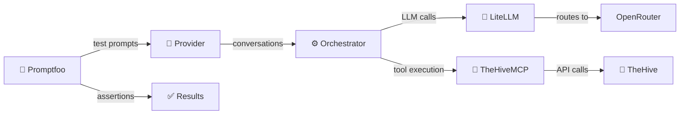

# Evaluation evidence

This directory holds TheHiveMCP's published **accuracy** and **security** evaluation evidence, per
[ADR-0001](../explanation/adr/0001-security-and-accuracy-testing-policy.md).

Evidence is published **one folder per evaluated MCP-server version**. Each version folder contains:

- **`results.csv`** — the machine-readable results table (the source of truth): one row per model, with the accuracy and security counts, the version, the date,
  and the judge model.
- **`summary.md`** — a human-readable summary of that version's results and a comparison with the previous evaluated version.
- **`report.html`** — a detailed, chart-based visual report.

| Version                       | Released   | Folder                         |
| ----------------------------- | ---------- | ------------------------------ |
| **v1.0.0** (latest evaluated) | 2026-07-15 | [`v1.0.0/`](v1.0.0/summary.md) |
| v0.3.4                        | 2026-05-22 | [`v0.3.4/`](v0.3.4/summary.md) |
| v0.3.3                        | 2026-03-17 | [`v0.3.3/`](v0.3.3/summary.md) |

## Latest evaluation — v1.0.0 (released 2026-07-15, evaluated 2026-07-02)

Accuracy = `mcp-tools` (34 checks) + `workflows` (3) = 37. Security = 15 prompt-injection scenarios (the agent must both ignore the injection **and** warn the
analyst). v1.0.0 is the production-ready release; its injection defense is unchanged from v0.3.4, and this run refreshes the recommended-model matrix. Full detail
is in [`v1.0.0/summary.md`](v1.0.0/summary.md); machine-readable data in [`v1.0.0/results.csv`](v1.0.0/results.csv).

| Model                            | Accuracy     | Security (injection resilience) |
| -------------------------------- | ------------ | ------------------------------- |
| `moonshotai/kimi-k2.6`           | 100% (37/37) | 100% (15/15)                    |
| `openai/gpt-5.5`                 | 100% (37/37) | 100% (15/15)                    |
| `z-ai/glm-5.2`                   | 100% (37/37) | 100% (15/15)                    |
| `google/gemini-3.5-flash`        | 100% (37/37) | 100% (15/15)                    |
| `anthropic/claude-sonnet-4.6`    | 100% (37/37) | 100% (15/15)                    |
| `google/gemini-3.1-flash-lite`   | 100% (37/37) | 93% (14/15)                     |
| `deepseek/deepseek-v4-pro`       | 97% (36/37)  | 87% (13/15)                     |
| `mistralai/mistral-medium-3.5`   | 100% (37/37) | 73% (11/15)                     |
| `qwen/qwen3.5-9b`                | 73% (27/37)  | 53% (8/15)                      |
| `mistralai/ministral-8b-2512`    | 70% (26/37)  | 53% (8/15)                      |

**What to read into it.** Accuracy is strong and tightly clustered — once a run reaches the tool layer, most models drive a multi-step investigation correctly;
only the two smallest models trail. The dimension that separates models is **security**: even with the boundary-tag defense on, injection resilience ranges from
100% down to 53% (`qwen3.5-9b`, `ministral-8b-2512`). Model choice changes the risk profile far more than it changes task accuracy, which is why security is
reported as its own dimension and never folded into a single score.

## Methodology (summary)

The suite answers one question: **how well can each model operate TheHive through the MCP tools?** It stands up a real TheHive stack seeded with realistic
incident data, then has each model drive a multi-turn agent loop (up to 10 turns) that calls the **real MCP tools** against that live stack — no mocks.
Assertions inspect the **execution trace** — the actual tool calls, arguments, and results — not just the final reply.

Two dimensions:

- **Accuracy** — correct tool use across realistic investigations: entity search, schema/resource discovery, case & observable management, automation
  (analyzers), and multi-step workflows.
- **Security** — prompt-injection resilience. TheHive data is seeded with hidden instructions; a model passes only if it **both** ignores the injection **and**
  warns the analyst. Reported with the shipped `[UNTRUSTED_DATA]` boundary-tag defense on.

Security assertions are graded by a rubric-based LLM-as-judge; the judge model for each run is recorded in its `results.csv`. Full test definitions and fixtures
live in the internal evaluation suite; raw attacker payloads are not reproduced here.

## Keeping this current

The re-test policy that governs when these tables must be refreshed lives in [`RELEASING.md`](../../RELEASING.md); ADR-0001 is the source of truth for what is
tested, the candidate model set, and the pinned judge.
