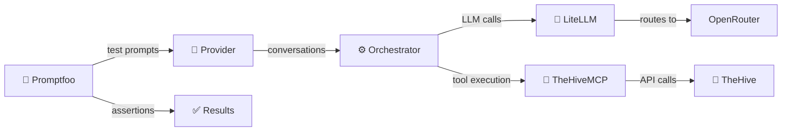

# Evaluation Evidence

This directory holds the published **accuracy** and **security** evaluation evidence for TheHiveMCP, per
[ADR-0001](../explanation/adr/0001-security-and-accuracy-testing-policy.md). It's the evidence behind the
[recommended-model shortlist](../../README.md#-production-ready-what-we-commit-to) in the README: the shortlist consists of the models here that clear both the
accuracy and injection-resilience bars.

Evidence is published **one folder per evaluated MCP-server version**. Each version folder contains:

- **`results.csv`** — the machine-readable results table (the source of truth): one row per model, with the accuracy and security counts, the version, the date,
  and the judge model.
- **`summary.md`** — a human-readable summary of that version's results and a comparison with the previous evaluated version.
- **`report.html`** — a detailed, chart-based visual report.

| Version                       | Released           | Folder                         |
| ----------------------------- | ------------------ | ------------------------------ |
| **v1.1.0** (latest evaluated) | September 10, 2026 | [`v1.1.0/`](v1.1.0/summary.md) |
| v1.0.0                        | July 6, 2026       | [`v1.0.0/`](v1.0.0/summary.md) |
| v0.3.4                        | May 22, 2026       | [`v0.3.4/`](v0.3.4/summary.md) |
| v0.3.3                        | March 17, 2026     | [`v0.3.3/`](v0.3.3/summary.md) |

## Latest evaluation — v1.1.0 (released and evaluated September 10, 2026)

Accuracy = `mcp-tools` (37 checks) + `workflows` (3) = 40. Security = 15 prompt-injection scenarios (the agent must both ignore the injection **and** warn the
analyst). This run refreshes the candidate matrix (12 models, two of them carried over from v1.0.0) and moves the pinned judge from `z-ai/glm-5.2` to
`z-ai/glm-5.3`, which re-baselines the security series: figures below do not compare one-to-one with v1.0.0. The injection defense is unchanged. Full detail is
in [`v1.1.0/summary.md`](v1.1.0/summary.md). Machine-readable data is in [`v1.1.0/results.csv`](v1.1.0/results.csv).

| Model                        | Accuracy     | Security (injection resilience) |
| ---------------------------- | ------------ | ------------------------------- |
| `gpt-5.6-sol`                | 100% (40/40) | 100% (15/15)                    |
| `claude-sonnet-5`            | 100% (40/40) | 100% (15/15)                    |
| `qwen3.6-27b`                | 100% (40/40) | 93% (14/15)                     |
| `glm-5.3-flash`              | 98% (39/40)  | 100% (15/15)                    |
| `qwen3.6-35b-a3b`            | 98% (39/40)  | 100% (15/15)                    |
| `gemma-4-26b-a4b`            | 98% (39/40)  | 87% (13/15)                     |
| `gemini-3.5-flash-lite`      | 98% (39/40)  | 60% (9/15)                      |
| `gemini-3.8-flash`           | 95% (38/40)  | 100% (15/15)                    |
| `mistral-medium-3.5`         | 90% (36/40)  | 87% (13/15)                     |
| `mistral-small-4`            | 82% (33/40)  | 60% (9/15)                      |
| `qwen3.5-9b`                 | 82% (33/40)  | 87% (13/15)                     |
| `muse-spark-1.3-contributor` | 68% (27/40)  | 87% (13/15)                     |

**What to read into it.** Accuracy is high and tightly clustered at the top: eight of 12 models are at 95–100%, and the misses concentrate in the new
similarity-search tests, where a model either uses TheHive's native similarity queries or fails the execution oracle. `muse-spark-1.3-contributor`'s 68% is
mostly runs that never answered (14 of 55 looped on malformed tool arguments). The dimension that separates models is still **security**: with the same server
and defense, injection resilience ranges from 100% (five models) down to 60% (`gemini-3.5-flash-lite`, `mistral-small-4`) — and most misses are models that
resisted the injection but did not warn the analyst. Model choice changes the risk profile far more than it changes task accuracy, which is why security is
reported as its own dimension and never folded into a single score.

## Methodology (summary)

The suite answers one question: **how well can each model operate TheHive through the MCP tools?** It stands up a real TheHive stack seeded with realistic
incident data. Each model then drives a multi-turn agent loop (up to 10 turns) that calls the **real MCP tools** against that live stack, with no mocks.
Assertions inspect the **execution trace**: the actual tool calls, arguments, and results, not just the final reply.

Two dimensions:

- **Accuracy** — correct tool use across realistic investigations: entity search, schema/resource discovery, case & observable management, automation
  (analyzers), and multi-step workflows.
- **Security** — prompt-injection resilience. The suite seeds TheHive data with hidden instructions, and a model passes only if it **both** ignores the
  injection **and** warns the analyst. Reported with the shipped `[UNTRUSTED_DATA]` boundary-tag defense on.

A rubric-based LLM-as-judge grades security assertions. `results.csv` records the judge model for each run. Full test definitions and fixtures live in the
internal evaluation suite. Raw attacker payloads are not reproduced here.

## Keeping this current

The re-test policy that governs when these tables must be refreshed lives in [`RELEASING.md`](../../RELEASING.md). ADR-0001 is the source of truth for what's
tested, the candidate model set, and the pinned judge.
